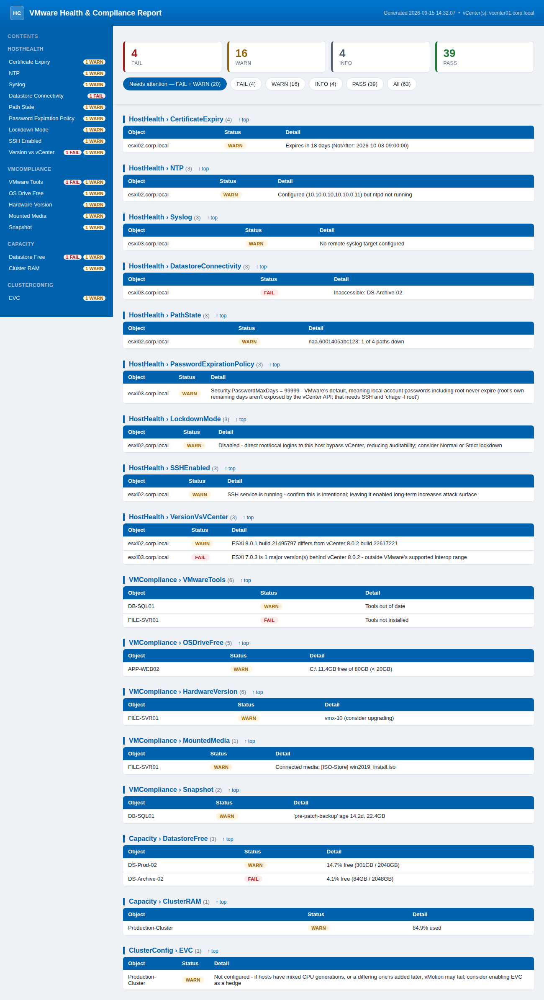
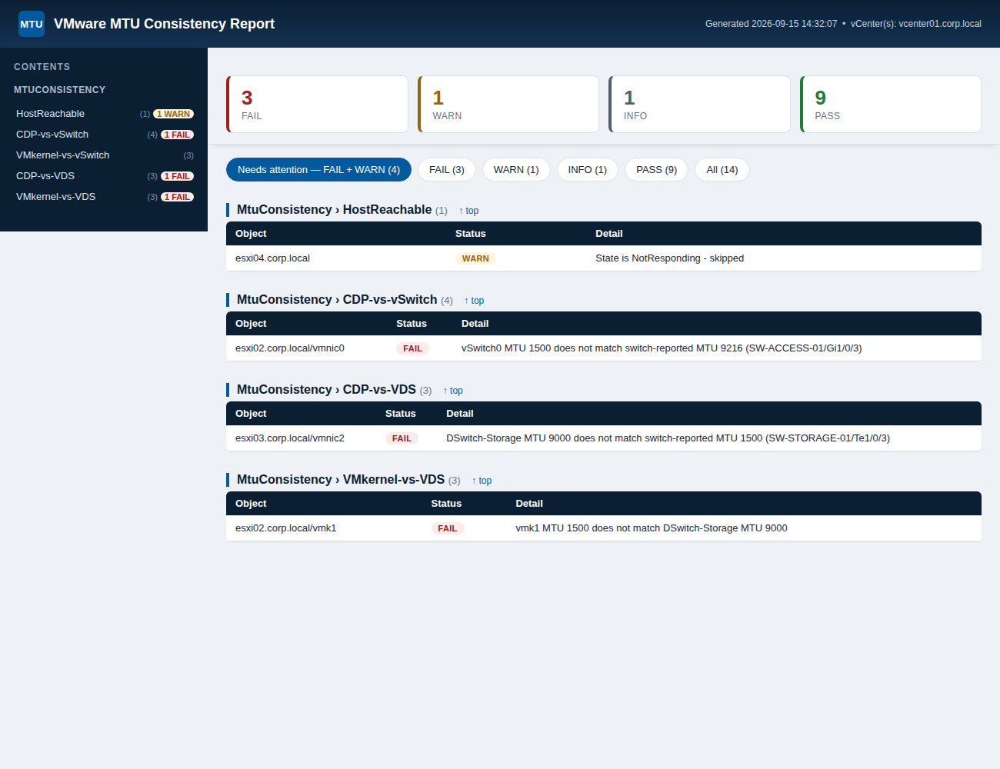

# VMware-Admin-Toolkit

A collection of PowerCLI scripts for automating routine VMware vSphere administration.
Everything here is built to be safe, parameterized, and report-driven.

## Contents

| Script | Purpose | Read-only? |
|--------|---------|------------|
| [`HealthCheck/Invoke-VMwareHealthCheck.ps1`](HealthCheck/Invoke-VMwareHealthCheck.ps1) | Health & compliance report across host health, VM compliance, capacity, and cluster config. Emits color-coded console output plus HTML and CSV reports. | ✅ Yes |
| [`UpdateCompliance/Invoke-VMwareUpdateCompliance.ps1`](UpdateCompliance/Invoke-VMwareUpdateCompliance.ps1) | Report VMs whose VMware Tools or VM hardware version need updating. Optional opt-in remediation (`-UpdateTools` / `-UpgradeHardware`) guarded by `-WhatIf`/`-Confirm`. | ✅ Report by default |
| [`ConsistencyCheck/Invoke-VMwareMtuConsistencyCheck.ps1`](ConsistencyCheck/Invoke-VMwareMtuConsistencyCheck.ps1) | Flags MTU mismatches across VMkernel adapters, the standard/distributed vSwitch they sit on, and the MTU the physically connected switch port reports via CDP. Emits color-coded console output plus HTML and CSV reports. | ✅ Yes |

## Requirements

- **PowerShell** 5.1+ or PowerShell 7+
- **PowerCLI** module (Broadcom renamed it from `VMware.PowerCLI` to `VCF.PowerCLI` in 13.x; the scripts accept either):
  ```powershell
  Install-Module VCF.PowerCLI -Scope CurrentUser
  ```
  > Install into the **same PowerShell edition** you run the scripts with — PS7 (`pwsh`) and Windows PowerShell 5.1 use separate module paths.
- Network access and read credentials to your vCenter Server(s).

## Usage

### Health Check

```powershell
# Prompted for credentials
.\HealthCheck\Invoke-VMwareHealthCheck.ps1 -VCenter vcenter01.corp.local

# Multiple vCenters, saved credential, custom thresholds, custom report path
$cred = Get-Credential
.\HealthCheck\Invoke-VMwareHealthCheck.ps1 -VCenter vc1,vc2 -Credential $cred `
    -ReportPath C:\Reports -SnapshotAgeWarningDays 7 -DatastoreFreeWarnPercent 25

# Require a valid (non-self-signed) TLS cert chain when connecting
.\HealthCheck\Invoke-VMwareHealthCheck.ps1 -VCenter vcenter01.corp.local -TrustAllCertificates:$false

# Flag any host whose syslog/NTP settings have drifted from the standard build
.\HealthCheck\Invoke-VMwareHealthCheck.ps1 -VCenter vcenter01.corp.local `
    -ExpectedSyslogServer 'udp://loghost01.corp.local:514' `
    -ExpectedNtpServer 10.10.0.10,10.10.0.11
```

By default, untrusted/self-signed vCenter certificates are accepted so the script
can connect to typical internal vCenters without extra setup (`-TrustAllCertificates`
defaults to `$true`). Pass `-TrustAllCertificates:$false` to require a valid chain
instead. Use that colon form: it binds correctly from a PowerShell session and under
`pwsh -File`. Under `powershell.exe -File` (Windows PowerShell 5.1) it does **not** bind
— 5.1 passes it as a literal string and the run stops with a parameter binding error
rather than silently trusting, so from a 5.1 scheduled task use `-Command` instead.
A failed connection to any vCenter is recorded as a `FAIL` in the report itself (not
just the console), and if every vCenter fails to connect, the run still produces a
report showing those failures.

The script checks:

- **Host health** — connection state, NTP, syslog (both optionally compared against an expected baseline), uptime, datastore connectivity, FC/iSCSI storage path state (dead paths, even when a datastore still reads as accessible on its remaining paths), TLS certificate expiry (ESXi hosts and vCenter itself), local account password expiration policy (root included), ESXi build vs. vCenter build, lockdown mode, SSH service state
- **VM compliance** — connection state (orphaned/inaccessible VMs), disk consolidation needed, VMware Tools, OS system drive free space (`C:\` / `/`), all other guest drives, VM hardware version, mounted ISOs/CD-ROMs, connected floppy drives, snapshot age
- **Capacity** — datastore free space, cluster CPU/RAM utilization
- **Cluster config** — HA, admission control, DRS, EVC

**Syslog & NTP baselines (`-ExpectedSyslogServer` / `-ExpectedNtpServer`).** By
default these two checks only answer "is *anything* configured?" — which passes a
host that's still shipping logs to a collector you decommissioned two years ago,
or syncing time from a retired NTP appliance. Pass the value your standard build
is supposed to have and each host's actual settings are compared against it in
**both directions**:

- **Missing** — an expected target isn't configured on the host.
- **Not in the baseline** — the host is configured with something your baseline
  doesn't list. This is the one that finds hosts built from an older image or
  hand-configured during an outage and never brought back in line.

Either one is a `WARN`, and the detail shows what the host actually has *and*
what was expected, side by side, so the fix is obvious from the report alone.
An exact match is a `PASS` reading `(matches expected baseline)`. With a baseline
supplied, a host with **nothing** configured is a `FAIL` rather than a `WARN` —
you've declared a collector is required, and the requirement is entirely unmet.

**Setting it up.** Don't guess at the value — read what your hosts actually
have first, then make the correct one your baseline. Sorting by the value groups
the hosts, so the odd ones out are obvious:

```powershell
Connect-VIServer vcenter01.corp.local
Get-VMHost | ForEach-Object {
    [pscustomobject]@{
        Host   = $_.Name
        Syslog = ($_ | Get-VMHostSysLogServer |
                    ForEach-Object { "$($_.Host):$($_.Port)" }) -join ', '
        NTP    = ($_ | Get-VMHostNtpServer) -join ', '
    }
} | Sort-Object Syslog | Format-Table -AutoSize
```

Whatever your build standard uses becomes the baseline, and every host that
disagrees is what these parameters exist to surface. Then pass it:

```powershell
.\HealthCheck\Invoke-VMwareHealthCheck.ps1 -VCenter vcenter01.corp.local `
    -ExpectedSyslogServer 'udp://loghost01.corp.local:514' `
    -ExpectedNtpServer 10.10.0.10,10.10.0.11
```

Quote a syslog value, since it contains `://`; NTP servers need no quotes.
Comma-separate to pass several.

**Always checking the same environment?** Give the parameters a default in the
`param()` block instead of typing them every run:

```powershell
[string[]] $ExpectedSyslogServer = 'udp://loghost01.corp.local:514',
[string[]] $ExpectedNtpServer    = @('10.10.0.10','10.10.0.11'),
```

Two things change if you do: the checks stop being opt-in, so a run against a
*different* vCenter with its own collector will `WARN` on every host; and
switching the comparison off for a single run then means passing an empty array
(`-ExpectedSyslogServer @()`). If you point this at more than one environment,
leaving the defaults empty and passing the value per run stays cleaner.

Matching is forgiving about spelling, so you don't get false failures from
equivalent notations: a `udp://` / `tcp://` / `ssl://` scheme prefix is ignored,
comparison is case-insensitive, a trailing dot on an FQDN is ignored, IPv6
literals compare correctly bracketed or not, and order doesn't matter. Leave the
`:port` off an expected entry (`-ExpectedSyslogServer loghost01.corp.local`) to
accept that host on any port. Omit the parameters entirely and both checks behave
exactly as they did before.

The NTP check keeps its existing behavior on top of this — `FAIL` when no servers
are configured at all, `WARN` when servers are set but the `ntpd` daemon isn't
running (a baseline mismatch and a stopped daemon are reported together in one
row, not one at a time).

**Cluster config detail.** Each cluster-config row says what the setting actually
does and what leaving it off costs you, rather than reporting a bare acronym:

- **HA** (High Availability) — restarts VMs on the surviving hosts when a host fails.
  `WARN` when disabled: the VMs a failed host was running stay down until someone
  restarts them by hand.
- **Admission control** — the reserve that makes HA's promise real. It holds back
  enough spare capacity to actually restart the VMs from a failed host, and blocks
  power-ons that would eat into that reserve. `WARN` when disabled, because HA is
  then enabled but reserving nothing — VMs from a failed host may fail to restart
  if the remaining hosts are already committed. This is an easy one to miss: HA
  reads as `PASS` while the capacity to honor it isn't guaranteed.
- **DRS** (Distributed Resource Scheduler) — balances VM load across hosts using
  vMotion. `WARN` when disabled, and a separate `DRSAutomation` `WARN` when DRS is
  on but not `FullyAutomated`, since it then only *recommends* migrations and
  rebalancing waits on someone approving them.
- **Host count** — `WARN` on a single-host cluster, where HA has nowhere to fail over.

**EVC (Enhanced vMotion Compatibility).** `PASS` with the cluster's current EVC mode
(e.g. `intel-broadwell`) if one is set, `WARN` if `Not configured`. EVC masks each
host's CPU down to a common baseline instruction set so a running VM can vMotion
between hosts with different CPU generations without the guest OS seeing the CPU
change mid-flight — without it, migrating to a host with an older/different feature
set can crash the guest or vMotion can refuse outright. The script can't tell from
vCenter alone whether a cluster's hosts actually span multiple CPU generations, but
`Not configured` is flagged `WARN` anyway (like the other cluster-config checks,
which also flag things that may be intentional) since enabling EVC is generally
recommended even for same-generation clusters, as a hedge in case a differing host
is added later.

**ESXi build vs. vCenter build.** VMware only supports ESXi hosts within roughly two
major versions behind vCenter, and a host *newer* than vCenter is unsupported outright
and can break management features. `PASS` when a host's version matches vCenter's
exactly; `WARN` on a minor version difference; `FAIL` when a host is newer than
vCenter, or more than `-HostVersionSkewFailMajors` (default 2) major versions behind
it. No extra vCenter round-trip is needed — the connection object from
`Connect-VIServer` and each host from `Get-VMHost` already carry `.Version`/`.Build`.

**Lockdown mode & SSH.** Two easy-to-miss host hygiene checks. `WARN` when a host's
lockdown mode is `Disabled` (direct root/local logins bypass vCenter, reducing
auditability — Normal or Strict is recommended), and `WARN` when the SSH (`TSM-SSH`)
service is running (often enabled temporarily for troubleshooting and then forgotten).

**VM connection state.** `FAIL` when a VM shows as `orphaned`, `inaccessible`, or
`invalid` — vCenter's inventory losing track of the VM, shown as the "question mark"
icon in the vSphere Client. Runs regardless of power state, since this doesn't
correlate with whether the VM is powered on. `WARN` on `disconnected` (the host may
just be temporarily unreachable).

**Storage path state.** A failed HBA or fabric takes the same path off *every* LUN at
once, so rather than printing one near-identical line per LUN (unreadable on a host
with dozens), LUNs are grouped by how much redundancy each has **left** — the thing
you'd actually act on — with headline counts first and the LUN list capped:

```
40 LUN(s): 2 offline, 12 degraded | OFFLINE - no active paths: naa.…d1, naa.…d2 | 3 of 4 paths active (12): naa.…01, naa.…02, naa.…03, naa.…04 +8 more
```

`FAIL` if any LUN has no active paths left, `WARN` if some are merely degraded.

**VM hardware version.** `WARN` below the `-HardwareVersionWarnNum` baseline (default
13), and rather than a bare "consider upgrading" it names a concrete target: the
highest version the VM's host/cluster can actually run, read from the compute
resource's `EnvironmentBrowser` rather than inferred from a hardcoded ESXi-version
table. For a cluster that value is already the common denominator across its hosts,
so the recommendation stays vMotion-safe. If the host/cluster can't go any higher
than the VM already is, it says so and suggests moving the VM to a newer host first.

Because the guest OS also has to support the target version — and that's only
answerable against VMware's compatibility guide — the detail names the guest OS to
check and flags that the upgrade needs a power-off and can't be rolled back.

**Disk consolidation needed.** `WARN` when a VM has leftover snapshot delta disks
that need consolidating — often left behind by backup software that didn't clean up
after itself, and easy to miss since it's a separate flag from the `Snapshot` check
above (a VM can need consolidation with no visible snapshot in the UI). Left alone,
these silently consume growing datastore space.

Findings are tagged `PASS` / `WARN` / `FAIL` / `INFO`. The script never modifies configuration.

**Runtime** scales with total inventory, since checks run per-host and per-VM (each a round-trip to vCenter). Connecting to multiple vCenters adds their inventories together. Rough guide:

| Inventory | Estimate |
|-----------|----------|
| ~25 VMs / 2-3 hosts | under a minute |
| ~150 VMs | a few minutes |
| 500+ VMs | 10+ minutes |

Add ~10-30s for the initial PowerCLI module import. As long as `PASS`/`WARN` lines keep printing, it's working — not hung.

**Output.** Everything printed to the console is also written to two timestamped files in `-ReportPath` (**defaults to the current directory** if not specified):

- `VMwareHealthCheck-<yyyyMMdd-HHmmss>.html` — styled, color-coded table
- `VMwareHealthCheck-<yyyyMMdd-HHmmss>.csv` — same rows, for Excel / trending

Both carry the columns **Category, Object, Check, Status, Detail**, and are written in a `finally` block — so you still get a report even if the run errors partway through. Pass `-ReportPath C:\Reports` to keep output in a fixed location instead of wherever you launched from.

**Exit codes.** The health check sets an exit code so a scheduled run can tell a
clean environment from a failing one without parsing the report:

| Code | Meaning |
|------|---------|
| `0` | run completed, no `FAIL` results |
| `2` | run completed, one or more `FAIL` results |
| `1` | the script itself errored and could not finish |

`2` is deliberately distinct from `1` — "the health check found problems" and "the
health check could not run" usually call for different responses. `WARN` and `INFO`
do not affect the exit code, and the HTML/CSV reports are already written before the
code is set.

Getting that code back out is launcher-specific, and the two options trade off:
`-File` propagates the exit code but passes arguments as plain strings (so it can't
take a list — `-VCenter vc1,vc2` arrives as one server literally named `vc1,vc2`),
while `-Command` parses arguments properly but collapses any non-zero script exit to
`1` unless you propagate `$LASTEXITCODE` yourself:

```powershell
powershell.exe -Command "& { .\HealthCheck\Invoke-VMwareHealthCheck.ps1 -VCenter vc1,vc2; exit $LASTEXITCODE }"
```

The HTML report uses a **dashboard-style layout** — a Dell-blue header bar, with the sidebar, table headers and links all drawn from that same blue, and status pill badges (`PASS`/`WARN`/`FAIL`/`INFO`), similar in feel to a Dell iDRAC or OpenManage console. Color-coded **stat tiles** at the top (Fail / Warn / Info / Pass counts) are clickable and double as the severity filter. The tiles and the filter buttons together **stay frozen at the top of the page** like a spreadsheet header row, so every count and filter stays reachable from anywhere in a long report instead of forcing a scroll back up — shown alongside the same **`Needs attention`, `FAIL`, `WARN`, `INFO`, `PASS`, `All`** filter buttons — the report opens pre-filtered to `FAIL` + `WARN` (what needs fixing), so you can drill straight to the problems instead of scrolling past everything that passed.

Results are also broken into **per-check sections** (e.g. *VMware Tools*, *Hardware Version*, *Mounted ISOs*, *Snapshots*, *NTP*, *Datastore Free*), each in its own table. The left **sidebar** lists every section grouped by category, with `FAIL`/`WARN` badges marking where the problems are — the **whole row is the link**, name and badges alike. Check names are spaced out there (`Certificate Expiry`, not `CertificateExpiry`) so the narrow column wraps at word boundaries; section headings keep the raw name, matching the CSV. Severity filtering and section navigation work together: under a filter, sections with no matching rows are hidden automatically, and clicking a sidebar entry whose section is hidden reveals **just that section** — it does not drop the whole report back to `All`. (The CSV stays complete and unfiltered for trending; open it in Excel and use AutoFilter on the Status column for the same effect.)

**Sample report** (fictional lab data):



### Update Compliance (VMware Tools & Hardware Version)

```powershell
# Report only — which VMs need Tools or hardware-version updates (target vmx-19)
.\UpdateCompliance\Invoke-VMwareUpdateCompliance.ps1 -VCenter vcenter01.corp.local

# Preview hardware upgrades to vmx-20 without changing anything
.\UpdateCompliance\Invoke-VMwareUpdateCompliance.ps1 -VCenter vc1 -TargetHardwareVersion 20 -UpgradeHardware -WhatIf

# Update VMware Tools on flagged powered-on VMs, without rebooting the guest
.\UpdateCompliance\Invoke-VMwareUpdateCompliance.ps1 -VCenter vc1 -UpdateTools -NoReboot
```

- **Report-only by default.** Remediation is opt-in via `-UpdateTools` / `-UpgradeHardware`.
- Hardware upgrades only run on **powered-off** VMs — powered-on VMs are skipped, never forced off.
- Both remediation paths support `-WhatIf` and `-Confirm`. Always run with `-WhatIf` first.
- Untrusted/self-signed vCenter certificates are accepted by default (`-TrustAllCertificates`); pass `-TrustAllCertificates:$false` to require a valid chain.

**Output.** Like the health check, results are written to two timestamped files in `-ReportPath` (**defaults to the current directory**): `VMwareUpdateCompliance-<yyyyMMdd-HHmmss>.html` and `.csv`, both with the columns **Category, Object, Check, Status, Detail**, produced in a `finally` block even if the run errors. Pass `-ReportPath C:\Reports` to fix the location. The HTML report opens pre-filtered to `FAIL` + `WARN` with the same clickable status buttons as the health check.

### MTU Consistency Check

```powershell
# Prompted for credentials
.\ConsistencyCheck\Invoke-VMwareMtuConsistencyCheck.ps1 -VCenter vcenter01.corp.local

# Multiple vCenters, saved credential, custom report path
$cred = Get-Credential
.\ConsistencyCheck\Invoke-VMwareMtuConsistencyCheck.ps1 -VCenter vc1,vc2 -Credential $cred -ReportPath C:\Reports
```

For every host, compares MTU across three layers per network path and flags where they disagree — a common cause of dropped jumbo frames and intermittent storage/vMotion problems:

- **VMkernel adapter** (`vmk0`, vMotion, storage, etc.) vs. the **standard or distributed vSwitch** it's on
- That same vSwitch/VDS vs. the **MTU reported by the physically connected switch port** (via CDP)
- Untrusted/self-signed vCenter certificates are accepted by default (`-TrustAllCertificates`); pass `-TrustAllCertificates:$false` to require a valid chain.

If CDP is disabled, or the connected switch only speaks LLDP, the CDP-vs-switch checks report `INFO` instead of guessing at a `PASS`/`FAIL`. Findings are tagged `PASS` / `WARN` / `FAIL` / `INFO`; the script never modifies configuration.

**Output.** Like the other reports, results are written to two timestamped files in `-ReportPath` (**defaults to the current directory**): `VMwareMtuConsistencyCheck-<yyyyMMdd-HHmmss>.html` and `.csv`, both with the columns **Category, Object, Check, Status, Detail**, produced in a `finally` block even if the run errors. The HTML report opens pre-filtered to `FAIL` + `WARN` with the same clickable status buttons and per-check sections as the health check.

**Sample report** (fictional lab data):



## Tests

`HealthCheck/Invoke-VMwareHealthCheck.ps1` has an end-to-end test suite that runs without a
vCenter, using a stub PowerCLI module:

```powershell
pwsh -File tests/Invoke-HealthCheckTests.ps1
```

It exits non-zero if any assertion fails. See [`tests/README.md`](tests/README.md).

## Conventions

- Scripts are **read-only by default**; any script that changes state will say so clearly and support `-WhatIf` where practical.
- Thresholds and targets are **parameters**, not hard-coded values.
- Output is written to both console and a timestamped report file where it makes sense.

## Roadmap

- Stale snapshot cleanup (report + optional removal)
- Template-based VM provisioning
- Inventory / capacity trending exports
